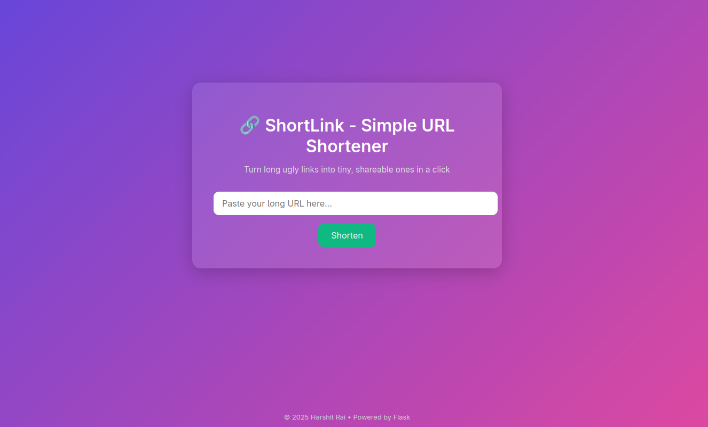

# Shortlink
### A URL Shortener Project
Shortlink is a clean and simple url shortener project built with Flask. It is designed to be fast, secure, and deployment-ready.

## 💡 Features:
- Autogenerated slugs for quick shortening
- Built-in redirection logic
- HTTPS supported
- Lightweight and deployable

## Usage:

Clone Shortlink repository.
```
git clone https://github.com/heyharshitrai/Shortlink.git
```
Navigate to Shortlink folder
```
cd shortlink
```
Install requirements
```
pip install -r requirements.txt
```
Run app.py
```
python run app.py
```



## Live Project: 
https://adnan-ali-007-shrtli-dplb.bolt.host/
